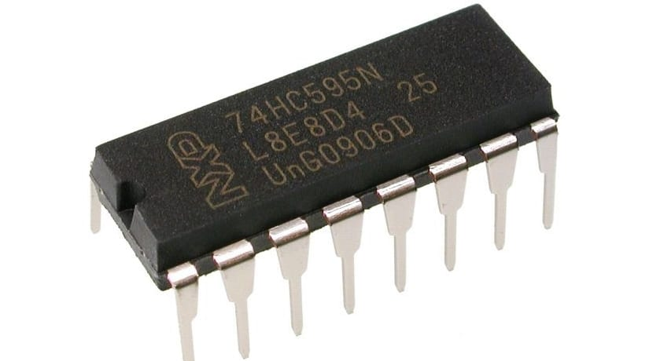

<center>


Created by Ouroboros Embedded Education.
</center>

## Versions Changelog

V1.0.0

- Initial Release

# l74xx595 Library Documentation

<center></center>

This documentation describes the **74xx595** C library for controlling 74xx595 (e.g., 74HC595, 74LS595) serial-in, parallel-out shift registers. The library is hardware-agnostic and supports multiple cascaded devices, thread safety, and flexible hardware abstraction via user-supplied function pointers.

---

## Table of Contents

- [Overview](#overview)
- [Features](#features)
- [File Structure](#file-structure)
- [Data Structures](#data-structures)
- [API Reference](#api-reference)
- [Usage Example](#usage-example)
- [Customization](#customization)
- [License](#license)

---

## Overview

The 74xx595 library provides a simple and extensible interface to control one or more cascaded 74xx595 shift registers using SPI and GPIO. It abstracts all hardware-specific operations, requiring the user to provide function pointers for SPI transmission and GPIO control (latch, output enable, master reset), as well as optional mutexes for thread safety.

---

## Features

- Supports multiple cascaded 74xx595 devices.
- Hardware abstraction for SPI and GPIO (user-supplied functions).
- Optional thread safety with mutex lock/unlock.
- Write single bytes or individual bits to any device in the chain.
- Internal or user-supplied buffer for shift register data.

---

## File Structure

- `l74xx595.h` – Main API header.
- `l74xx595.c` – Implementation file.
- `l74xx595_defs.h` – (Not shown; for future definitions or macros.)

---

## Data Structures

### Error Codes

```c
typedef enum {
    L74XX595_OK,
    L74XX595_FAIL
} l74xx595_err_e;
```


### Function Pointer Typedefs

```c
typedef void    (*l74xx595_gpio_t)(bool sig);                // GPIO control (LATCH, MR, OE)
typedef void    (*l74xx595_mtx_t)(void);                     // Mutex lock/unlock
typedef uint8_t (*l74xx595_spi_t)(uint8_t *bff, uint8_t len); // SPI transmit
```


### Handler Structure

```c
typedef struct {
    struct {
        l74xx595_spi_t   fxnSpiTransmit;
        l74xx595_gpio_t  fxnGpioLATCH;
        l74xx595_gpio_t  fxnGpioMR;
        l74xx595_gpio_t  fxnGpioOE;
        l74xx595_mtx_t   fxnMtxLock;
        l74xx595_mtx_t   fxnMtxUnlock;
    } fxns;
    bool     bInitialized;
    uint8_t  u8NumberOfDevices;
    uint8_t *pu8IntBuffer;
} l74xx595_t;
```


### Initialization Parameters

```c
typedef struct {
    l74xx595_spi_t   fxnSpiTransmit;
    l74xx595_gpio_t  fxnGpioLATCH;
    l74xx595_gpio_t  fxnGpioMR;
    l74xx595_gpio_t  fxnGpioOE;
    l74xx595_mtx_t   fxnMtxLock;
    l74xx595_mtx_t   fxnMtxUnlock;
    uint8_t          u8NumberOfDevices;
    uint8_t         *pu8ExtBuffer; // Optional: user-supplied buffer
} l74xx595_params_t;
```


---

## API Reference

### Initialization

```c
l74xx595_err_e l74xx595_init(l74xx595_t *handler, l74xx595_params_t *params);
```

**Description:**
Initializes the 74xx595 handler, checks all required function pointers and parameters, and sets up the internal state. Allocates an internal buffer if the user does not supply one.

- `handler`: Pointer to the handler structure.
- `params`: Pointer to the initialization parameters.
- **Returns:** `L74XX595_OK` on success, `L74XX595_FAIL` on error.

---

### Write Byte

```c
l74xx595_err_e l74xx595_write_byte(l74xx595_t *handler, uint8_t Index, uint8_t WriteByte);
```

**Description:**
Writes a byte to the specified shift register in the chain and updates the outputs.

- `handler`: Pointer to the handler.
- `Index`: Index of the device (0 = first device in chain).
- `WriteByte`: The byte to write.
- **Returns:** `L74XX595_OK` on success, `L74XX595_FAIL` on error.

---

### Write Bit

```c
l74xx595_err_e l74xx595_write_bit(l74xx595_t *handler, uint8_t Index, uint8_t bit, bool WriteBit);
```

**Description:**
Sets or clears a single bit in the specified device and updates the outputs.

- `handler`: Pointer to the handler.
- `Index`: Index of the device (0 = first device in chain).
- `bit`: Bit position (0-7).
- `WriteBit`: `true` to set, `false` to clear.
- **Returns:** `L74XX595_OK` on success, `L74XX595_FAIL` on error.

---

## Usage Example

```c
#include "l74xx595.h"

// User must implement these functions for their hardware:
void my_gpio_latch(bool sig);
void my_gpio_mr(bool sig);
void my_gpio_oe(bool sig);
uint8_t my_spi_transmit(uint8_t *buffer, uint8_t len);
void my_mutex_lock(void);
void my_mutex_unlock(void);

l74xx595_t shift_handler;
l74xx595_params_t params = {
    .fxnSpiTransmit = my_spi_transmit,
    .fxnGpioLATCH   = my_gpio_latch,
    .fxnGpioMR      = my_gpio_mr,
    .fxnGpioOE      = my_gpio_oe,
    .fxnMtxLock     = my_mutex_lock,   // Optional
    .fxnMtxUnlock   = my_mutex_unlock, // Optional
    .u8NumberOfDevices = 2,            // For two cascaded 74xx595 chips
    .pu8ExtBuffer   = NULL             // Use internal buffer
};

void setup(void) {
    if (l74xx595_init(&shift_handler, &params) == L74XX595_OK) {
        // Write 0xAA to first device, 0x55 to second device
        l74xx595_write_byte(&shift_handler, 0, 0xAA);
        l74xx595_write_byte(&shift_handler, 1, 0x55);
        // Set bit 3 of device 1
        l74xx595_write_bit(&shift_handler, 1, 3, true);
    }
}
```


---

## Customization

- **SPI, GPIO, Mutex:**
Implement the hardware-specific functions for your microcontroller or platform.
- **Buffer:**
Provide your own buffer via `pu8ExtBuffer` or let the library allocate one.
- **Thread Safety:**
Use mutex functions if accessing from multiple threads.

---

## License

See the source files for license information.
Author: Pablo Jean (pablo-jean), August 2024

---

**For further details, refer to the code and comments in the provided source files.**